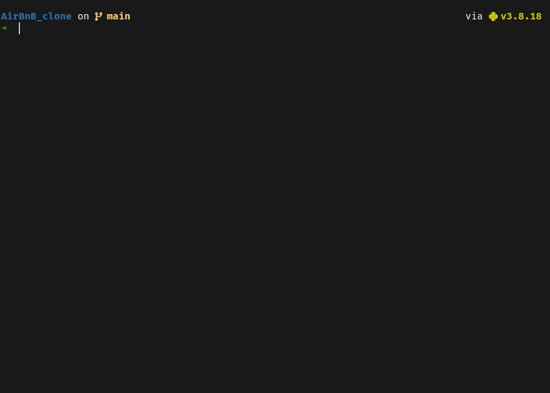

# 0x00. AirBnB clone - The console

## Description

This is the AirBnB clone project. The goal of the project it to deploy a simple
copy of the AirBnB website on a server. We won't implement all the features
just only some of them to cover fundamental concepts of the higher level
programming track.

This project is done in teams of 2, a list of contributors is found in the
[AUTHORS](./AUTHORS) file.

The project is built in steps:

1. The console
1. Web Static
1. MySQL storage
1. Web framework - Flask
1. RESTful API
1. Web dynamic

This repo is for the console part of the AirBnB clone.

## The console

The console is the first part of the AirBnB clone. It is used to manipulate a
powerful storage system/engine. This storage engine will give us an abstraction
between “My object” and “How they are stored and persisted”.

This means that from our console code (the command interpreter itself) and
from the front-end and RestAPI we will build later, we won’t have to pay
attention (take care) to how our objects are stored.

The activities performed are:

- create a data model object
- manage (create, update, destroy, etc) objects via a console / command interpreter
- store and persist objects using a JSON file

This abstraction will also allow us to change the type of storage easily
without updating all of our code base. The console will be a tool to validate
this storage engine

## Features

The console is built using the `cmd` python module. It supports the following
commands:

- `create`
  - usage: `create <class name>`
  - creates a new instances, saves it to the JSON file and then prints the
    `id` of the new instance.
- `show`
  - usage: `show <class name> <id>`
  - prints the string representation of the instance with the given a
    class name and id
- `destroy`
  - usage: `destroy <class name> <id>`
  - deletes an instance with the given class name and id
- `all`
  - usage: `all [class name]`
  - if class name is given then it will print a list of the string
    representation of all the instances with the given class only, but if no
    class name is provided then it will print for all instances
- `update`
  - usage: `update <class name> <id> <attribute name> <attribite value>`
  - updates an instance based on the class name and id, by adding or updating
    an attribute
  - only one attribute can be updated at a time
  - the attribute value is casted to the attribute type
  - it also saves the change to the JSON file

The console also has a `help` command that will display the documentation
for other commands. The classes available to use with the commands are:

- `BaseModel`
- `User`
- `City`
- `State`
- `Place`
- `Amenity`
- `Review`

In the development of the console some assumptions and rules were given such as:

- Arguments are always given in the right order
- Each arguments are separated by a space
- A string argument with a space must be between double quotes
- The error management starts from the first argument to the last one
- When updating an instance the attribute values are given to be simple
  arguments, such as `int`, `float` or `str`
- Extra arguments are ignored

## Usage

To start using the console run `./console.py`. Here is a preview of the console.

## Extra Commands

In addition we were also given advanced tasks to implement the commands above
again but in different syntax. This commands are handled by overriding the
`cmd.precmd(line)` method of the `cmd` module.

The commands are:

- `<class name>.all()`
  - same as `all <class name>`
- `<class name>.count()`
  - prints the number of instances with a given class name
- `<class name>.show(<id>)`
  - same as `show <class name> <id>`
- `<class name>.destroy(<id>)`
  - same as `destroy <class name> <id>`
- `<class name>.update(<id>, <attribute>, <value>)`
  - same as `update <class name> <id> <attribute> <value>`
- `<class name>.udpate(<id>, <dict>)`
  - updates an instance of a given class name and id, with a dictionary `<dict>`

A preview of these commands is shown below.

